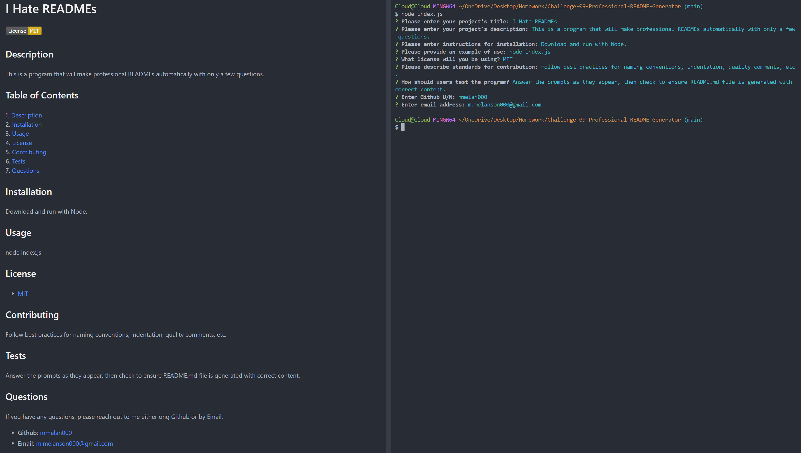

# I Hate Doing READMEs  
[](https://www.gnu.org/licenses/gpl-3.0)  

## Description  

This is a program that will make professional READMEs automatically with only a few questions.  

## Table of Contents  
1. [Description](#description)  
2. [Installation](#installation)  
3. [Usage](#usage)  
4. [Questions](#questions)  
5. [Contributing](#contributing)  
6. [Tests](#tests)  
7. [License](#license)

## Installation  

1. Download.
2. Use NPM to install inquirer@8.2.4  
3. Run with Node.

## Usage  

**[Walkthrough Video](https://drive.google.com/file/d/16kG3nYP8nuznHHM4zX5IJNo8nJDFk0n6/view?usp=sharing)**

```node index.js```  



## Contributing  

Follow best practices for naming conventions, indentation, quality comments, etc.  

## Tests  

Answer the prompts as they appear, then check to ensure README.md file is generated with correct content.  

## Questions  

If you have any questions, please reach out to me either ong Github or by Email.
  - **Github:** [mmelan000](https://github.com/mmelan000)
  - **Email:** [m.melanson000@gmail.com](mailto:m.melanson000@gmail.com)

## License  

- [GNU](https://www.gnu.org/licenses/gpl-3.0)  
